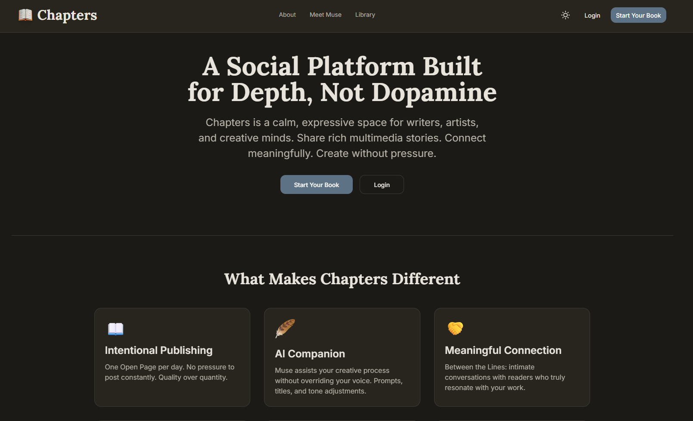
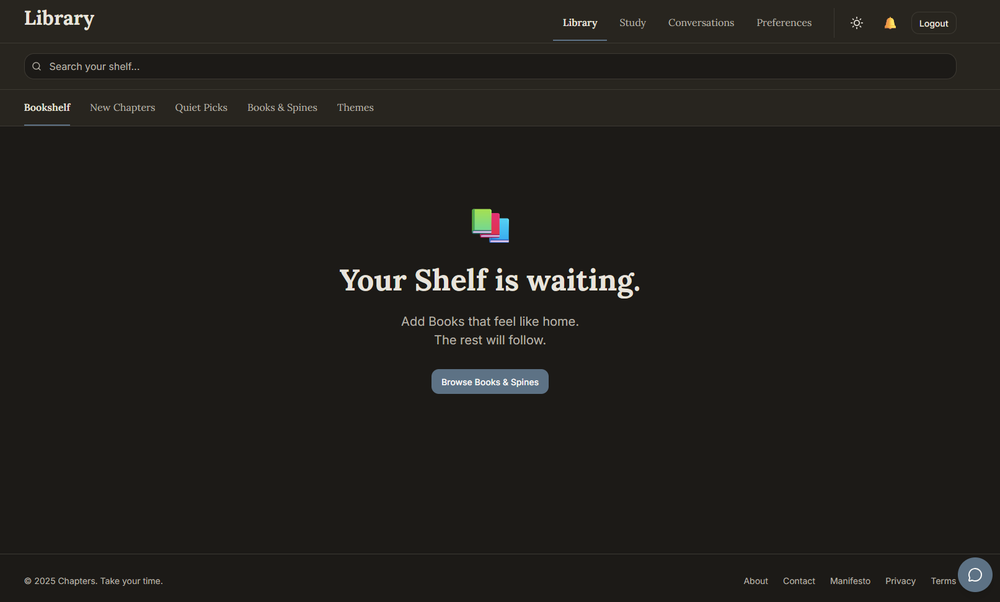
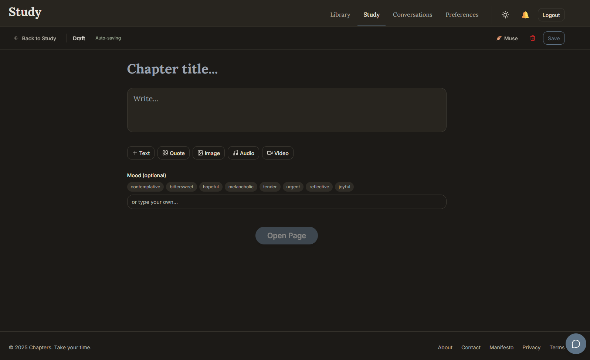
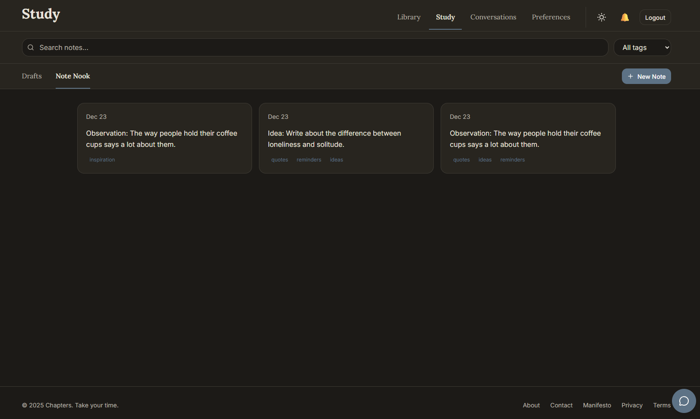
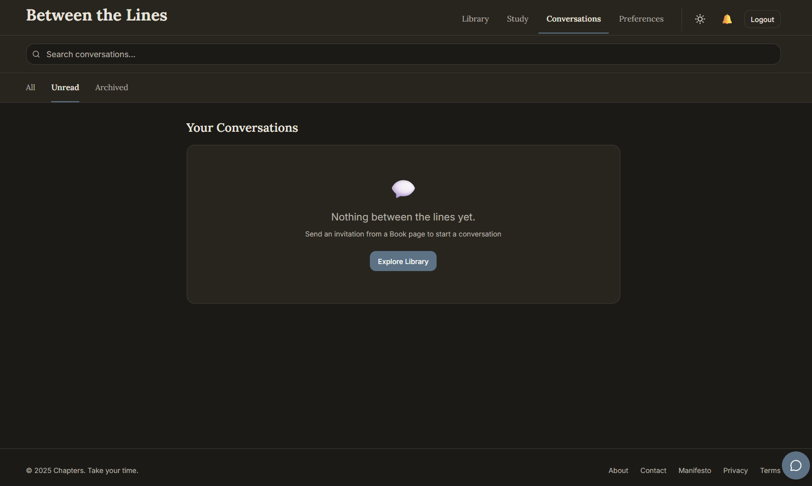
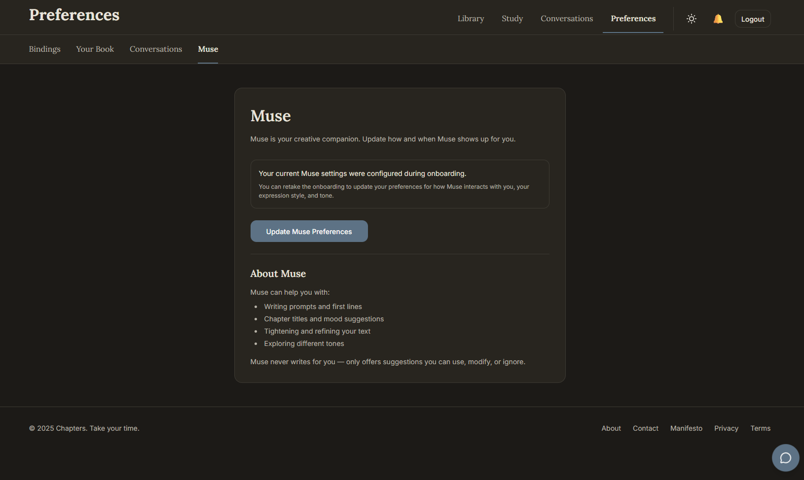

# 📖 Chapters

> **Everyone's a book. Each post is a chapter.**

[](AGENTS.md)
[](https://vercel.com/new/clone?repository-url=https%3A%2F%2Fgithub.com%2Fnetzkontrast%2Fchapters&env=DATABASE_URL,SECRET_KEY,OPENAI_API_KEY,S3_BUCKET,S3_ACCESS_KEY,S3_SECRET_KEY&project-name=chapters&repository-name=chapters)

Chapters is a calm, intentional social platform for people with inner lives, curious minds, and discernment.

It's built for those who prefer depth over noise, reading over scrolling, and reflection over performance.

Discovery happens through ideas and writing, not algorithms or virality.

At its core, Chapters is a place to read closely, think deeply, and write when you're ready.

**Muse AI** lives quietly inside the experience as a creative and thinking companion, offering prompts, reflection, and support only when invited, never replacing the human voice.

---

## Who Chapters Is For

Chapters is for people who:
- Read closely and think carefully
- Enjoy ideas, questions, and unfinished thoughts
- Value discernment over speed
- Want technology that respects attention

You don't need to be a writer.  
You don't need to publish.  
You just need an inner life.

---

## 📑 Table of Contents

- [Current Status](#-current-status)
- [Quick Start](#-quick-start)
- [Project Structure](#-project-structure)
- [Tech Stack](#️-tech-stack)
- [Design Philosophy](#-design-philosophy)
- [Key Features](#-key-features)
- [Development](#-development)
- [Documentation](#-documentation)
- [Deployment](#-deployment)
- [What Makes Chapters Different](#-what-makes-chapters-different)
- [Screenshots](#️-screenshots)
- [Contributing](#-contributing)
- [License](#-license)

---

## 🎯 Current Status

**Backend**: ✅ Complete (70+ tests passing)  
**Mobile App**: ✅ Complete (React Native + Expo)  
**Web App**: ✅ Complete (Next.js 14)  
**Deployment**: ✅ Ready for Vercel Monorepo

All core features implemented and tested. The project is configured as a monorepo ready for one-click deployment to Vercel (Backend + Frontend), with Expo EAS for mobile distribution.

## 🚀 Quick Start

### Start Backend
```bash
# Windows
scripts\start-dev.bat

# Mac/Linux
chmod +x scripts/start-dev.sh
./scripts/start-dev.sh
```
Choose option 1 (Full Docker) for the easiest setup.

### Seed Database (Optional)
```bash
# Windows
scripts\seed-docker.bat

# Mac/Linux
chmod +x scripts/seed-docker.sh
./scripts/seed-docker.sh
```

Creates 5 demo users (password: `password123`), chapters, and engagement data.

### Start Frontend
```bash
cd frontend
npm install
npm run dev
```

### Start Mobile (Optional)
```bash
cd mobile
npm install
npm start
```

**Access Points:**
- Backend API: http://localhost:8000
- API Docs: http://localhost:8000/docs
- Web App: http://localhost:3000

For detailed setup, see [docs/setup.md](docs/setup.md)

---

## 📁 Project Structure

```
chapters/
├── backend/              # FastAPI backend (Python)
│   ├── app/              # Application code
│   │   ├── auth/         # Authentication
│   │   ├── books/        # User profiles
│   │   ├── chapters/     # Chapter posts
│   │   ├── study/        # Drafts & notes
│   │   ├── library/      # Feeds & discovery
│   │   ├── muse/         # AI companion
│   │   └── ...           # Other modules
│   ├── alembic/          # Database migrations
│   ├── tests/            # Test suite (70+ tests)
│   └── pyproject.toml    # Dependencies
│
├── frontend/             # Next.js web app (TypeScript)
│   ├── src/
│   │   ├── app/          # Pages (App Router)
│   │   ├── components/   # UI components
│   │   ├── hooks/        # React Query hooks
│   │   └── services/     # API clients
│   └── package.json
│
├── mobile/               # React Native app (TypeScript)
│   ├── app/              # Expo Router pages
│   ├── src/
│   │   ├── components/   # UI components
│   │   ├── hooks/        # React Query hooks
│   │   └── services/     # API clients
│   └── package.json
│
├── docs/                 # Documentation
│   ├── requirements.md   # Feature requirements
│   ├── design.md         # System architecture
│   ├── tasks.md          # Implementation plan
│   ├── visuals.md        # Design system
│   └── README.md         # Docs guide
│
└── vercel.json           # Vercel Monorepo Configuration
```

## 🛠️ Tech Stack

### Backend
- **Framework**: FastAPI (Python 3.11+)
- **Database**: PostgreSQL 15+ with pgvector
- **ORM**: SQLAlchemy + Alembic migrations
- **Cache & Queue**: Redis 5+
- **AI**: OpenAI API (GPT-4, DALL-E 3, embeddings)
- **Storage**: S3-compatible (Cloudflare R2 / AWS S3)
- **Testing**: pytest with property-based tests

### Mobile (Primary Client)
- **Framework**: React Native with Expo 52
- **Language**: TypeScript
- **State**: React Query + Zustand
- **Animations**: Reanimated 3
- **Navigation**: Expo Router 4

### Web (Secondary Client)
- **Framework**: Next.js 14 (App Router)
- **Styling**: Tailwind CSS + shadcn/ui
- **Animations**: Framer Motion
- **Deployment**: Vercel (Monorepo)

## 🎨 Design Philosophy

Chapters is built with calm intentionality:

### Core Principles
- **Finite by Design** - No infinite scroll, all feeds are bounded
- **Intentional Publishing** - One Open Page per day (max 3 stored)
- **Privacy First** - Everything starts private in Study
- **AI as Companion** - Muse assists but never overrides, only when invited
- **Calm Engagement** - No trending, no leaderboards, no streaks

### Visual Identity
- **Colors**: Warm, muted palette (Paper White, Ink Black, Soft Sage)
- **Typography**: Serif for reading, sans-serif for UI
- **Interactions**: Subtle, never demanding attention
- **Inspiration**: Books, libraries, lamplight, ink on paper

See [docs/visuals.md](docs/visuals.md) for complete design system.

## ✨ Key Features

### For Writers, Readers, and Thinkers

**Write with intention:**
- **Open Pages** - Daily publishing allowance (3 max, 1 per day)
- **Study** - Private workspace for drafts, notes, voice memos
- **Rich Blocks** - Text, images, audio, video, quotes (max 12 per chapter)
- **Edit Window** - 30 minutes to refine after publishing
- **Muse AI** - Writing prompts, title suggestions, tone shaping (optional, invited)

**Read and discover:**
- **Library** - Visual bookshelf of Books you follow
- **Quiet Picks** - 5 daily AI-curated recommendations (taste, not popularity)
- **Spines** - Discover Books through their work, not profiles
- **Page-Turn Reading** - Smooth, book-like experience on mobile

**Share your work:**
- **Chapters** - Rich, multimedia posts with mood and theme
- **AI Covers** - DALL-E 3 generated chapter covers (optional)
- **Book Profile** - Your living anthology with Inside Flap (bio)
- **Privacy Controls** - Public or private Books

**Engage thoughtfully:**
- **Hearts** - Appreciate chapters that resonate (Soft Sage, not red)
- **Bookmarks** - Save chapters to return to
- **Shelf** - Curate Books you want to keep close
- **Margins** - Comments hidden by default, revealed on demand

### For Connection

**Connect through work:**
- **Between the Lines** - Intimate 1:1 conversations (requires mutual follows + 3 chapters)
- **Resonance** - AI-calculated compatibility between readers
- **Shelf** - Public curation of Books that matter to you
- **No Cold Outreach** - All connection requires established presence

## 🧪 Development

### Backend Testing
```bash
cd backend
poetry run pytest                    # Run all tests
poetry run pytest tests/properties/  # Property-based tests
poetry run pytest -v                 # Verbose output
```

### Database Migrations
```bash
cd backend
poetry run alembic revision --autogenerate -m "description"
poetry run alembic upgrade head
poetry run alembic downgrade -1
```

### Background Workers
```bash
cd backend
poetry run rq worker  # Start background job worker
```

### Frontend Development
```bash
# Web
cd frontend
npm run dev          # Development server
npm run build        # Production build
npm run lint         # Lint check

# Mobile
cd mobile
npx expo start           # Start Expo dev server
npx expo start --ios     # iOS simulator
npx expo start --android # Android emulator
```

## 📖 Documentation

Comprehensive documentation in the `docs/` folder:

- **[vision.md](docs/vision.md)** - Product philosophy, manifesto, glossary, and copy guidelines
- **[requirements.md](docs/requirements.md)** - Feature requirements (200+ requirements)
- **[design.md](docs/design.md)** - System architecture and data models
- **[tasks.md](docs/tasks.md)** - Implementation plan status
- **[visuals.md](docs/visuals.md)** - Design system and color palette
- **[testing.md](docs/testing.md)** - Testing strategy and property tests
- **[deployment.md](docs/deployment.md)** - Vercel & Expo deployment guide

### Feature Glossary

Quick reference for key terms (see [vision.md](docs/vision.md) for complete list):

**User Identity:**
- **Book** - Your profile (not "account")
- **Inside Flap** - Your bio (not "about")
- **Book Portrait** - Your profile picture
- **Bindings** - Account security (password)

**Content:**
- **Chapter** - A post (not "update")
- **Open Page** - Daily publishing allowance
- **Block** - Content element (text, image, audio, video, quote)
- **Study** - Private workspace for drafts and notes

**Discovery:**
- **Library** - Main view (not "feed")
- **Bookshelf** - Books you follow
- **Spines** - People discovery through work
- **Quiet Picks** - Daily AI recommendations
- **Shelf** - Curated collection of Books

**Engagement:**
- **Heart** - Appreciate a chapter (Soft Sage, not red)
- **Bookmark** - Save for later
- **Margins** - Comments (hidden by default)
- **Between the Lines** - Private 1:1 conversations

**AI:**
- **Muse** - Your creative companion (not "bot")
- **Taste Profile** - AI-learned preferences
- **Resonance** - Compatibility between readers

See [docs/README.md](docs/README.md) for a guide to all documentation.

## 🚀 Deployment

### Backend & Web (Vercel Monorepo)
```bash
# Push to main branch
# Vercel automatically deploys based on vercel.json
# Ensure environment variables are set in Vercel Dashboard
```

### Mobile (Expo EAS)
```bash
cd mobile
eas build --platform all
eas submit --platform all
```

See [docs/deployment.md](docs/deployment.md) for detailed instructions.

## 🎯 What Makes Chapters Different

- **No infinite scrolling** - Bounded, page-based navigation  
- **No trending lists** - Calm discovery through taste profiles  
- **No streak pressure** - Create on your own schedule  
- **No red hearts** - Soft Sage for gentle engagement  
- **No viral mechanics** - Quality over virality  
- **No pure white/black** - Warm, paper-like colors  
- **No auto-publish AI** - Muse suggests, you decide  
- **No cold outreach** - Between the Lines requires mutual trust  

## 🖼️ Screenshots

<details>
<summary><b>Landing Page</b></summary>


*A calm, intentional introduction to Chapters*

</details>

<details>
<summary><b>Library - Your Reading Space</b></summary>


*Discover chapters through Bookshelf, New Chapters, Quiet Picks, Books & Spines, and Themes*

</details>

<details>
<summary><b>Study - Your Private Workspace</b></summary>


*Write and refine your chapters in private with Muse's gentle guidance*


*Capture thoughts, observations, and ideas in your Note Nook*

</details>

<details>
<summary><b>Muse AI - Your Creative Companion</b></summary>


*Get suggestions for openings, titles, moods, and refinements - only when invited*

</details>

<details>
<summary><b>Between the Lines - Thoughtful Conversations</b></summary>


*Intimate 1:1 conversations with readers who resonate with your work*

</details>

<details>
<summary><b>Preferences - Personalize Your Experience</b></summary>


*Customize your Book profile, security settings, and Muse preferences*

</details>

## 🤝 Contributing

Chapters is built with intention and care. Before contributing, please read [CONTRIBUTING.md](CONTRIBUTING.md) to understand our values and approach.

We welcome thoughtful contributions that align with our philosophy of calm, depth, and respect for attention.

## 📄 License

See [LICENSE](LICENSE) file for details.

---

## 🌟 Philosophy in Practice

> **Chapters is slow by design. It rewards reflection, depth, and presence.**

**Welcome to Chapters. Take your time.**

---

**Built with**: FastAPI • React Native • Next.js • PostgreSQL • OpenAI  
**Designed for**: Depth • Reflection • Authentic Expression
